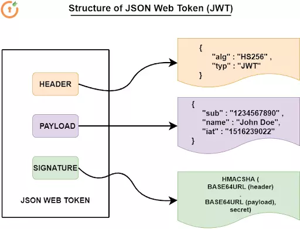

# Authentication

- In this process, we send the username and password to the `Authentication` server.
- `Authentication` server will validate those credentials and generate a random `JSON Web Token (JWT)` and sent it back to the end-user.
- Client receives that token, then stores it in local storage

# Authorization

- In, the `Authorization` we check whatever credential entered by the user while the `Authentication` process and that same user will have granted access to the resource using the credential which we store in the `Authentication` process and then Authorize that particular user.

---

# What is JWT (JSON Web Token)?

- JWT, or JSON Web Token, is an open standard used to share information between two parties securely — a client and a server. In most cases, it’s an encoded JSON containing a set of claims and a signature. It’s usually used in the context of other authentication mechanisms like OAuth, OpenID to share user-related information. It’s also a popular way to authenticate/authorize users in a microservice architecture.
- JWT authentication is a token-based stateless authentication mechanism. It is popularly used as a client-side-based stateless session, this means the server doesn’t have to completely rely on a data store (or) database to save session information.

## Structure of JWT

- JWT structure is divided into three parts: header, payload, signature & is separated from each other by dot (.), and will follow the below structure:
  - **Header**
    - The header consists of two parts:
      1.  The signing algorithm being used
      2.  The type of token, which is in this case mostly “JWT”
  - **Payload**
    - The payload usually contains the claims (user attributes) and additional data like issuer, expiration time, and audience.
  - **Signature**
    - This is typically a hash of the header and payload sections of the JWT. The algorithm which is used to create the signature is the same algorithm mentioned in the header section of the JWT. Signature is used to validate that the JWT token wasn’t modified or changed during transit. It can also be used to validate the sender.
    - The header and Payload section of the JWT is always Base64 encoded.

---

# Open Endpoints

Open endpoints require no Authentication.

- [Sign In](./sign-in.md) : `POST /api/v1/authentication/sign-in/`
- [Sign Up](./sign-up.md) : `POST /api/v1/authentication/sign-up/`
- [Reset Password](./reset-password.md) : `POST /api/v1/authentication/reset-password/`

# Endpoints that require Authentication

Closed endpoints require a valid Token to be included in the header of the
request. A Token can be acquired from the Login view above.

## Current User related

Each endpoint manipulates or displays information related to the User whose
Token is provided with the request:

- [Activate Account](./activate-account.md) : `POST /api/v1/authentication/activate-account/`
- [Resend Activate OTP](./resend-activate-otp.md) : `POST /api/v1/authentication/resend-activate-otp/`
