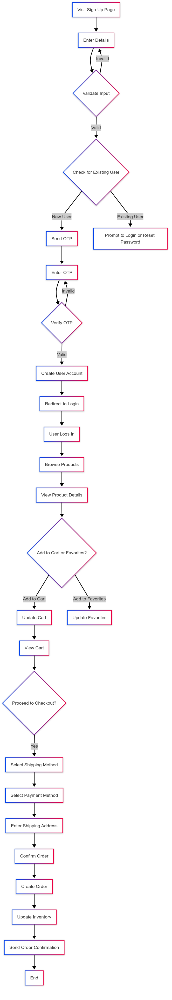

# This is app flow of the c-store

## 1. Sign-Up Flow

### 1. Visit Sign-Up Page:

User navigates to the sign-up page.

### 2. Enter Details:

User provides details:

- Email
- Password
- Phone number

### 3 Validate Input:

System validates the input (e.g., email format, password strength).

### 4. Check for Existing User:

- System checks if the email is already registered in the User table.
- If the email exists, the user is prompted to log in or reset their password.

### 5. Send OTP:

- System generates a One-Time Password (OTP) and sends it to the user's email or phone.
- OTP is stored temporarily (e.g., in a OTP table or cache) with an expiration time.

### 6. Enter OTP:

- User navigates to the OTP verification page.
- User enters the OTP received via email or phone.

### 7. Verify OTP:

- System checks if the entered OTP matches the stored OTP and is not expired.
- If valid, the user proceeds to the next step.
- If invalid, the user is prompted to re-enter the OTP or request a new one.

### 8. Create User Account:

- System creates a new User record.
- A default UserSetting record is created for the user.
- User is marked as verified.

### 9. Redirect to Login:

- User is redirected to the login page to log in with their new credentials.

## 2. Product Browsing

### 1. Browse Products:

- User navigates to the product listing page.
- System fetches products from the Product table, including associated Category and ProductUnit details.
- User can filter products by category, price, or rating.

### 2. View Product Details:

- User clicks on a product to view details.
- System fetches product details, reviews (Review table), and images (Image table).
- User can add the product to their cart or favorites.

## 3. Cart Management

### 1. Add to Cart:

- User clicks "Add to Cart" on a product page.
- System creates or updates a CartItem record linked to the user and product.
- Cart total is updated.

### 2. View Cart:

- User navigates to the cart page.
- System fetches CartItem records for the user, including product details.
- User can update quantities or remove items.

### 2. Proceed to Checkout:

- User clicks "Checkout."
- System validates cart (e.g., checks stock availability).
- User is redirected to the checkout page.

## 4. Checkout and Order Placement

### 1. Select Shipping Method:

- User selects a shipping method from available options (ShippingMethod table).
- System calculates shipping costs.

### 2. Select Payment Method:

- User selects a payment method (PaymentMethod table) or adds a new one.
- System validates payment details.

### 2. Enter Shipping Address:

- User selects an existing address (Address table) or adds a new one.
- System validates the address.

### 3. Confirm Order:

- User reviews order details (products, shipping, payment, total).
- User clicks "Place Order."
- System creates an Order record and associated OrderItem records.
- System updates inventory (Product table) and creates an OrderStatus record.

### 4. Order Confirmation:

- System sends an order confirmation email to the user.
- User is redirected to the order confirmation page.

## 5. Order Tracking

### 1. View Order History:

- User navigates to the order history page.
- System fetches Order records for the user, including OrderStatus and OrderItem details.

### 2. Track Order Status:

- User clicks on an order to view details.
- System displays the current status (OrderStatus table) and tracking information.

## 6. User Profile Management

### 1. Update Profile:

- User navigates to the profile page.
- User can update their name, email, or password.
- System updates the User record.

### 2. Manage Addresses:

- User can add, edit, or delete addresses (Address table).
- Manage Payment Methods:
- User can add, edit, or delete payment methods (PaymentMethod table).

### 3. Manage Favorites:

- User can view or remove items from their favorites (FavoriteItem table).
