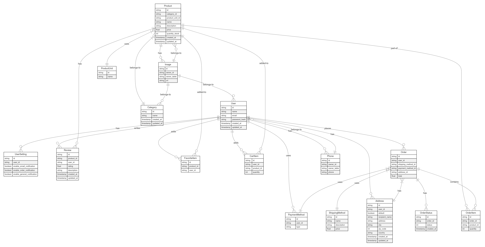

# C-Store API Entity Relationship Diagram Documentation

## Overview

This document provides comprehensive documentation for the Entity Relationship Diagram (ERD) of the C-Store API project. The ERD illustrates the database structure, entity relationships, and data models that form the foundation of our e-commerce platform.

## Diagram Structure

The ERD is organized into the following core modules:

- User Module: User accounts and related personal information
- Product Module: Product catalog and categorization
- Shopping Module: Cart, orders, and purchase flow
- Supporting Entities: Images, addresses, and other shared resources

## Entity Descriptions

### User Module

- User: Core user account information including authentication details
- UserSetting: User preferences for notifications and account settings
- Phone: Contact information associated with users
- Address: Shipping and billing addresses for users
- PaymentMethod: Saved payment methods for checkout

### Product Module

- Product: Core product information including pricing and inventory
- Category: Hierarchical product categorization
- ProductUnit: Measurement units for products (e.g., each, kg, liter)
- Image: Visual assets for products and categories
- Review: User feedback and ratings for products

### Shopping Module

- FavoriteItem: Products saved to user wishlists
- CartItem: Products added to shopping carts
- Order: Complete order information
- OrderItem: Individual products within orders
- OrderStatus: Order fulfillment status tracking
- ShippingMethod: Available shipping options and rates

### Relationships

The diagram illustrates key relationships including:

- One-to-many relationships (e.g., User to Orders)
- Many-to-many relationships (e.g., Products to Orders via OrderItems)
- One-to-one relationships (e.g., User to UserSettings)

## Data Types and Conventions

- All IDs are implemented as strings (UUIDs)
- Timestamps track creation and modification dates
- Boolean flags indicate settings and preferences
- Foreign keys maintain referential integrity

## Implementation Notes

This ERD serves as the blueprint for database schema implementation and provides guidance for API endpoint development. The relationships defined here inform authorization rules, cascade behaviors, and data validation requirements.
