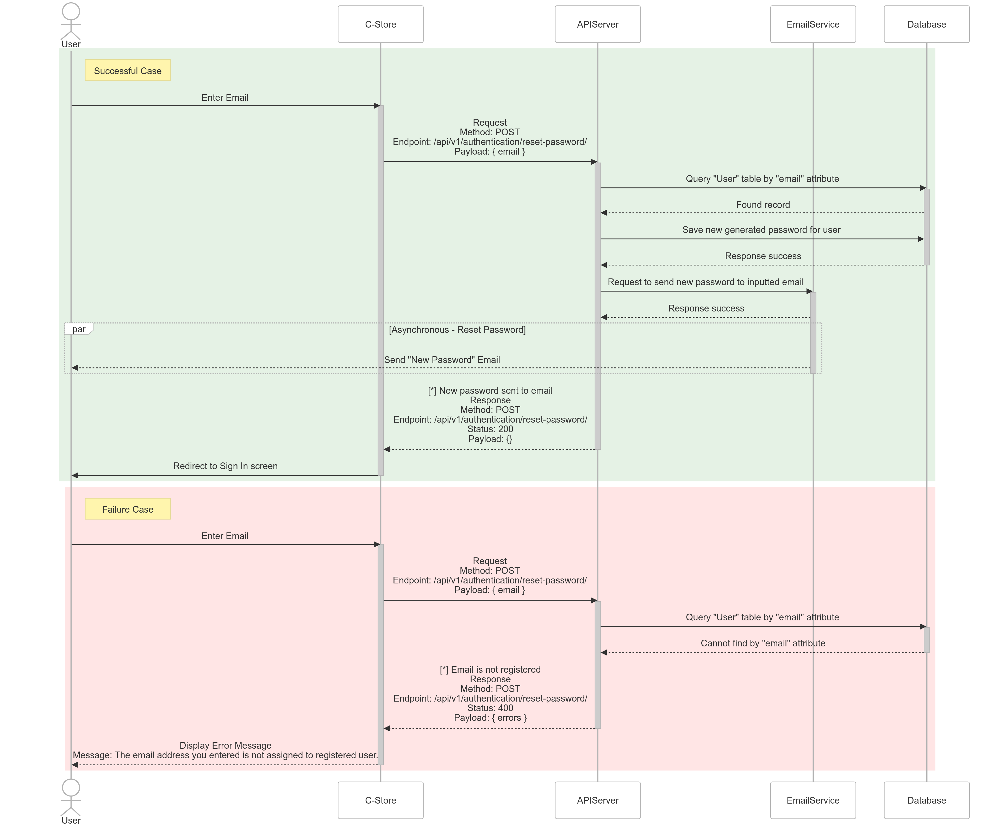

# Reset Password

## Sequence Diagram



---

## User Reset Password

Used to reset password for a registered User.

**URL:** `/api/v1/authentication/reset-password/`

**Method:** `POST`

**Auth required:** NO

**Request Data constraints**

```json
{
  "email": "[valid email address]"
}
```

**Request Data example**

```json
{
  "email": "iloveauth@example.com"
}
```

## Success Response

**Code:** `200 OK`

**Content example**

```json
{}
```

## Error Response

**Condition:** If provided 'email' is not registered.

**Code:** `400 BAD REQUEST`

**Content:**

```json
{
  "errors": [
    "The email address you entered is not assigned to registered user."
  ]
}
```
